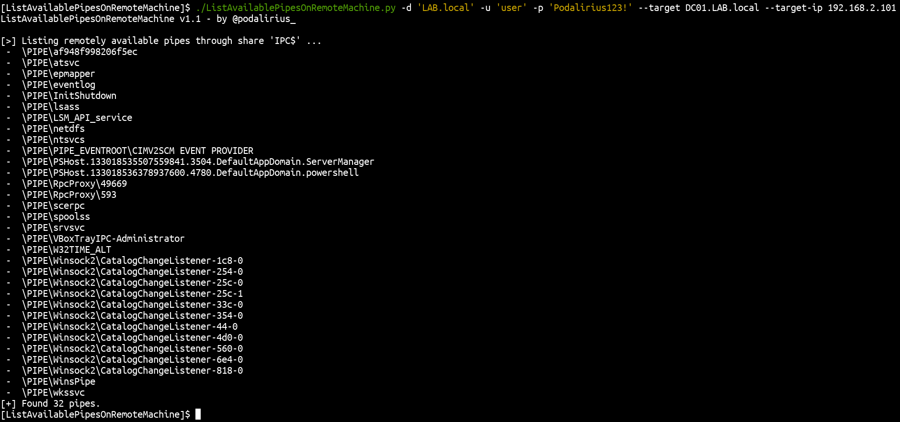

# ListAvailablePipesOnRemoteMachine

A script to list available SMB pipes remotely on a Windows machine through the IPC$ share.

## Features

 - [x] List available SMB pipes through the share `IPC$`
 - [x] Live mode to refresh list every seconds with `--live`

## Usage

```
$ ./ListAvailablePipesOnRemoteMachine.py -h                                                                                            
ListAvailablePipesOnRemoteMachine v1.1 - by @podalirius_

usage: ListAvailablePipesOnRemoteMachine.py [-h] [-u USERNAME] [-p PASSWORD] [-d DOMAIN] [--hashes [LMHASH]:NTHASH] [--no-pass] [-k] [--target ip address]
                                            [--target-ip ip address] [-P [destination port]] [-v]

A script to list available SMB pipes remotely on a Windows machine through the IPC$ share.

options:
  -h, --help            show this help message and exit
  -u USERNAME, --username USERNAME
                        Username to authenticate to the endpoint.
  -p PASSWORD, --password PASSWORD
                        Password to authenticate to the endpoint. (if omitted, it will be asked unless -no-pass is specified)
  -d DOMAIN, --domain DOMAIN
                        Windows domain name to authenticate to the endpoint.
  --hashes [LMHASH]:NTHASH
                        NT/LM hashes (LM hash can be empty)
  --no-pass             Don't ask for password (useful for -k)
  -k, --kerberos        Use Kerberos authentication. Grabs credentials from ccache file (KRB5CCNAME) based on target parameters. If valid credentials cannot be found, it
                        will use the ones specified in the command line
  --target ip address   Target machine.
  --target-ip ip address
                        IP Address of the target machine. If omitted it will use whatever was specified as target. This is useful when target is the NetBIOS name or
                        Kerberos name and you cannot resolve it
  -P [destination port], --port [destination port]
                        Destination port to connect to SMB Server
  -v, --verbose         Verbose mode. (default: False)

```

## Example



## Live mode demonstration

Here is a video demonstrating the `--live` option on [ListAvailablePipesOnRemoteMachine.py](ListAvailablePipesOnRemoteMachine.py):

https://user-images.githubusercontent.com/79218792/178469180-5ce2c60a-259a-4531-af6e-4c3e8513dc33.mp4
